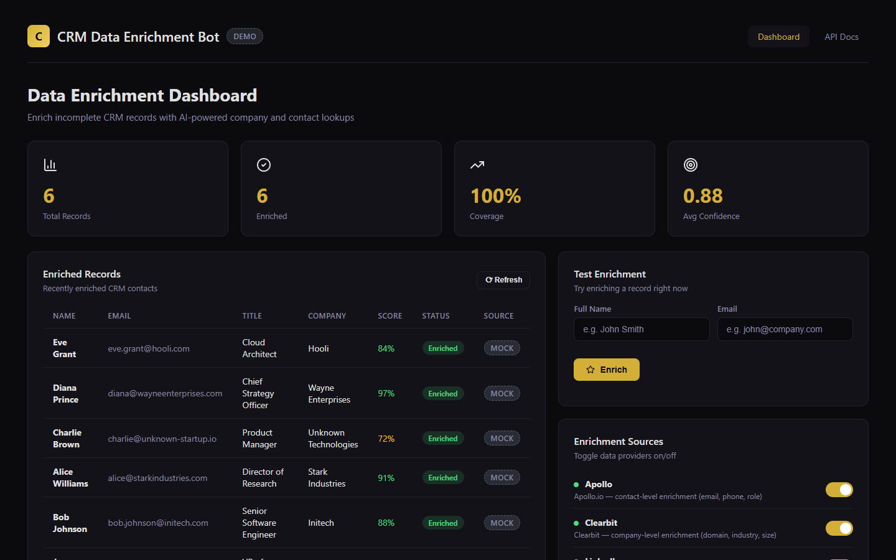
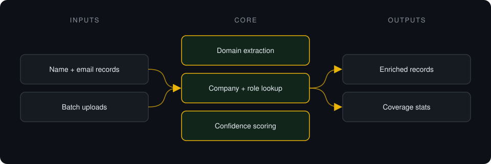
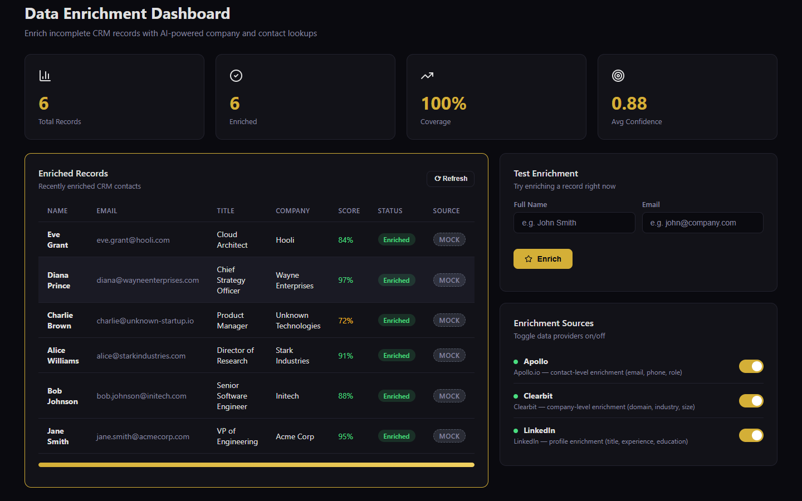

# CRM Data Enrichment

**Enrichment pipeline prototype: takes CRM records with only a name and email and fills in company, role and contact fields.**

> **This is a proprietary project. Source code is private. This page showcases the system's architecture and results.**

**Case study page:** [https://jryahia.github.io/showcase-crm-data-enrichment/](https://jryahia.github.io/showcase-crm-data-enrichment/)

## Problem it solves

CRM records often arrive with just a name and an email. This prototype models the enrichment pipeline (domain extraction, company lookup, role prediction, confidence scoring) behind a single API and dashboard.

## Architecture

1. Records arrive individually or in batches.
2. The email domain is extracted and used for company lookup.
3. Role and contact fields are filled in with a confidence score.
4. Enriched records and coverage stats are stored and shown.

## Key features

- Single and batch enrichment endpoints
- Confidence score per record
- Toggleable lookup sources
- Coverage dashboard
- Clearly flagged demo engine: no live Apollo or Clearbit calls

## Tech stack

   

## What it does in practice

- Prototype stage: enrichment currently uses a built-in demo engine with generated data, and every record is labelled as mock.

## Screenshots

**Enriched records with confidence (demo engine)**

**Enrichment sources and test enrichment (demo engine)**

---

Built by [Yahya Jarray](https://github.com/jryahia). Interested in a similar system? [Get in touch](mailto:yahiajarray43@gmail.com).

This repository contains no source code. It is a case study for a proprietary project. © Yahya Jarray.
